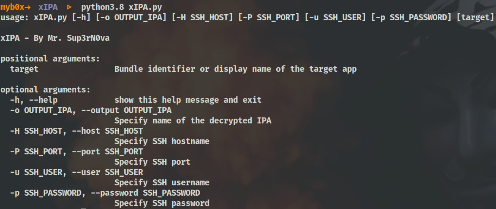
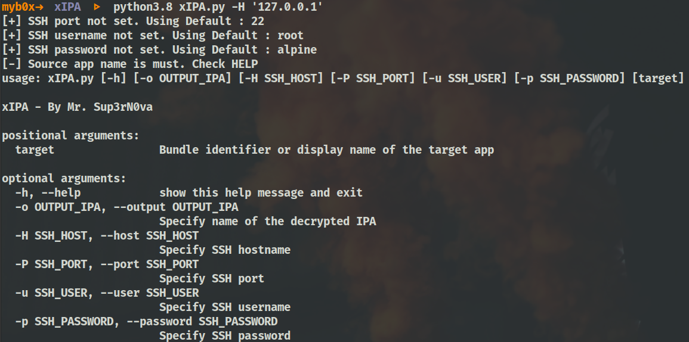
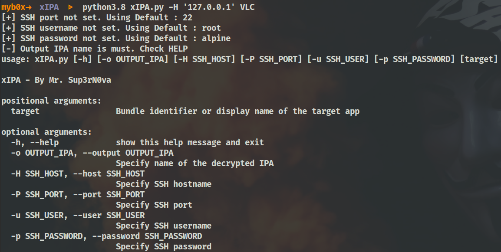
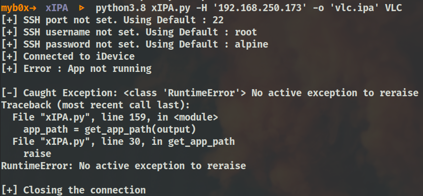
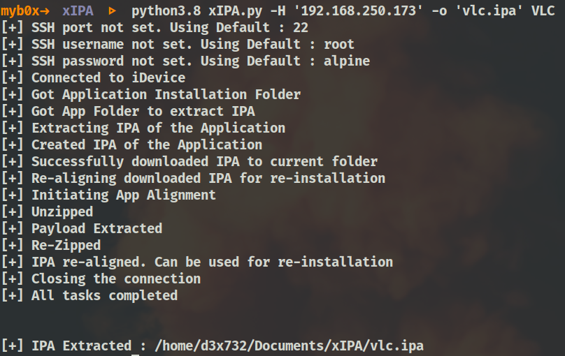
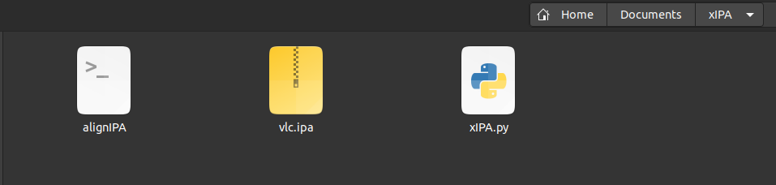

# xIPA

(a.k.a - Extract IPA) - Script to extract IPA files

## Introduction

* Script designed to extract **IPA** of an application installed on a **JailBroken iDevice**
* Tested on multiple applications including **Banking** applications
* Extracts and downloads the **IPA** to your **$PWD**

## Pre-requisites

* Any linux distro
* An **iOS** app called **Filza** - Optional but comes handy to get app names
* Supports **Python3** only
* Supporting **PIP** libraries to be installed:
    * For SSH - `python3.8 -m pip install --upgrade paramiko`
    * For Command Line Argument Parsing - `python3.8 -m pip install --upgrade argparse`

* **MOST IMPORTANT** - A **JailBroken iDevice**

## Summary

* I came across the idea to write this script when I faced issue extracting the IPA file for analysis. We have a great tool called [**frida-ios-dump**](https://github.com/AloneMonkey/frida-ios-dump), but unfortunately was not working for me. There were lot of errors related to **"diskimagemount"** or **"hooking"** to the process via **"frida"**. The other reason was to learn how to write similar codes.
* So, finally I came up with my own **"python script"**, to extract **IPAs** of installed applications for analysis. The best part about this is there is no need of **Frida** as we are not **hooking** into any process nor we need **USB** connection to get the **IPA**.
* Just one application to be installed on **iPhone** or **iPAD** which is **Filza** which can come handy to get app names.

## How does it work

* All you have to do is to run the script and provide all details and it will download the extracted IPA in your **$PWD** which you can later use for re-installation. 
* For re-installation just `scp` your downloaded **IPA** file to **iDevice** and use **Filza** to install.
* I tested it with most of the applications including **Banking** ones and it's working just fine. **_Let me know if it breaks anywhere_**

**NOTE**

> Make sure that the app is running on your **iDevice** before you start the script

> Extraction process will become slow if your **iDevice** sleeps. Make sure that the **iDevice** is wide awake

## Screenshots

* **xIPA - Help**

    

* **xIPA - Missing iDevice IP to SSH**

    

* **xIPA - Missing App Display Name to Extract {target}**

    

* **xIPA - Missing Extracted App Name {-o/--output}**

    

* **xIPA - App not running**

    

* **xIPA - Success: Extracted IPA of VLC App**

    

* **xIPA - Success: Downloaded Extracted IPA**

    

> **DISCLAIMER** : **JailBreak** your device at our own risk. This is just to provide **information** and is for **knowledge sharing**.
